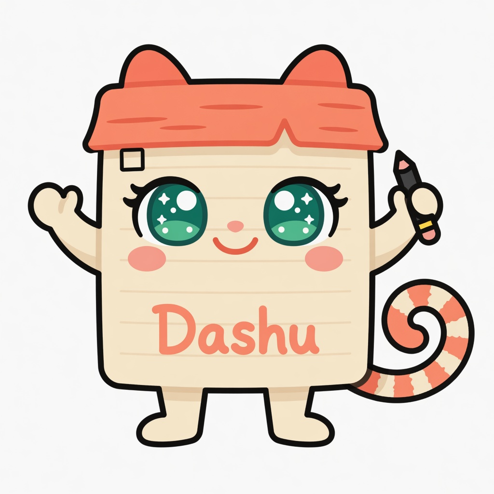

<div align="center">
  
  <h1 style="border-bottom: none; margin-bottom: 0;">todo-bar</h1>
  <h3 style="margin-top: 0; font-weight: normal;">
    open markdown todos in the mac menu bar
  </h3>
  <p><em>open items only</em> · starring <strong>Dashu</strong></p>
</div>

<br />

Mac menu-bar app for open items (`- …`) across one or more todo markdown files.

The mascot is **Dashu** — the sticky-note checklist spirit who checks dashes off your list.

## What it does

- Tabs for multiple files (default: `~/todos.md`, then `~/Documents/todos.md`)
- **+** adds another `.md` (e.g. `books.md`, `deals.md`, `marketing/todo.md`)
- Right-click tab → Rename / Reveal / Remove
- Shows open items (`- task`) grouped by `##` section
- **Complete** — removes the line; if `CHANGELOG.md` exists beside the file or at git root, logs under today (`MM/DD/YY`, 2-space indent); `git commit`s
- **Reorder** — drag within a section; rewrites + commits
- Live-reloads when the active file changes
- Tabs persist in UserDefaults

## Build & run

```bash
./build.sh
open "build/todo-bar.app"
```

## Format

- `- item` = open (shown)
- no leading dash = done / not listed
- `## Section` = group header
