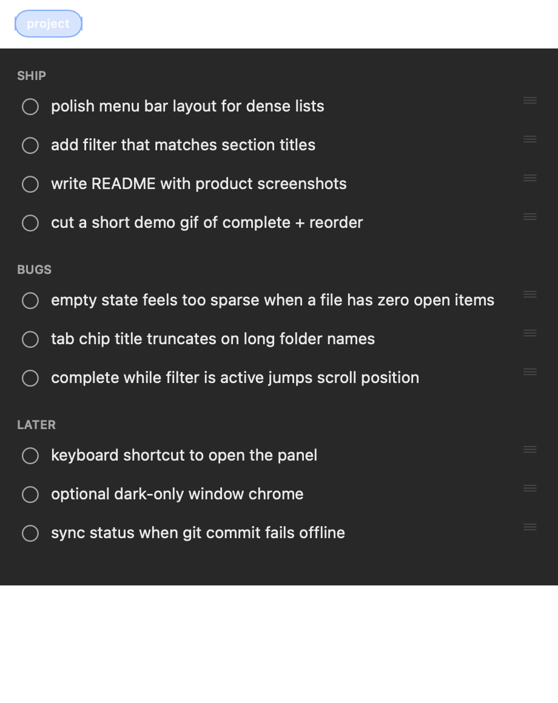
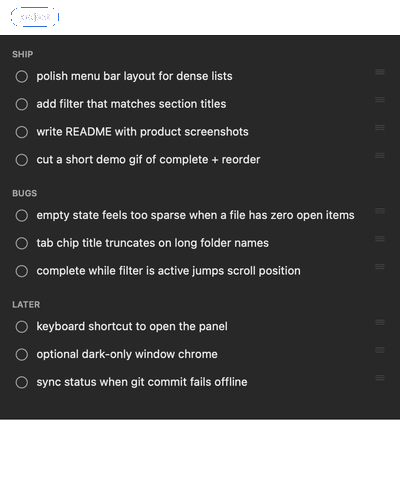
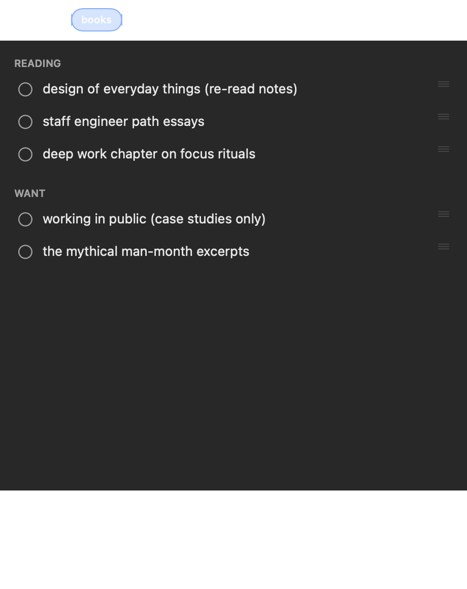

<p align="center">
  
</p>

<h1 align="center">todo-bar</h1>

<h3 align="center">mac menu bar app for open items in plain markdown todos</h3>

<p align="center">
  
</p>

## What it does

- Tabs for multiple files (default: `~/todos.md`, then `~/Documents/todos.md`)
- **+** adds another `.md` (e.g. `books.md`, `deals.md`, `marketing/todo.md`)
- Right-click tab → Rename / Reveal / Remove
- Shows open items (`- task`) grouped by `##` section; completed stay hidden until **Show Completed**
- **+** — new to-do is **prepended at the top** of the first section (pre-header `To-Dos` when present)
- **Click** circle — mark complete (`- [x]`), move that line to the **end of the file**; **Show Completed** to see / reopen
- Each add/edit/complete/delete **commits**, then **pushes** if the file's repo has an upstream
- On launch, tab switch, panel open, and **Refresh** — **pulls** from upstream (`--rebase --autostash`) then reloads
- **Click** text — expand; **double-click** (or right-click → Edit) to rewrite
- **Right-click** — Mark Complete / Reopen, Move, Edit, Copy, **Delete**
- **Reorder** — ↑↓ on open items (or context menu)
- Live-reloads when the active file changes; tabs persist in UserDefaults

<p align="center">
  
</p>

## Build & run

```bash
./build.sh
open "build/todo-bar.app"
```

Smoke / unit tests (pure `TodoDocument` + temp-repo store integration — required after logic changes):

```bash
./build.sh --smoke
# or: bash scripts/smoke.sh
```

## Format

- `- item` = open (shown)
- `- [x] item` = completed (line moved to end of file; hidden until Show Completed)
- `## Section` = group header

## Sample data

Screenshots use fake lists in `docs/demo/` (not anyone's real todos). Regenerate:

```bash
bash scripts/render-screenshots.sh
```
